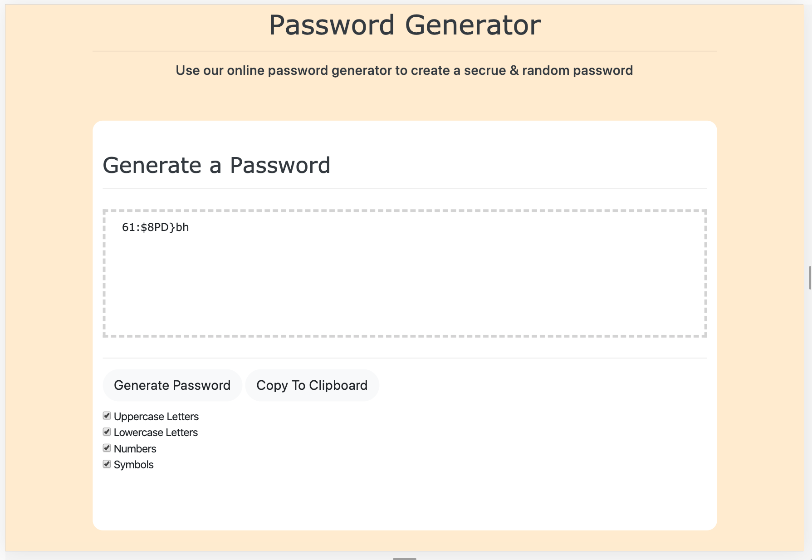

# Homework-3
Creating a code generator with save to clipboard feature.

Code Generator app:

I have created an app that generates a new code using upper case,
lowercase, and mixed symbols. 

If you click on "generate Password", the generator will automatically
update a new password with every click.

If you click "copy to clipboard", the text in the text area will then be 
coppied to your computers clipboard and for you to paste where ever needed.

